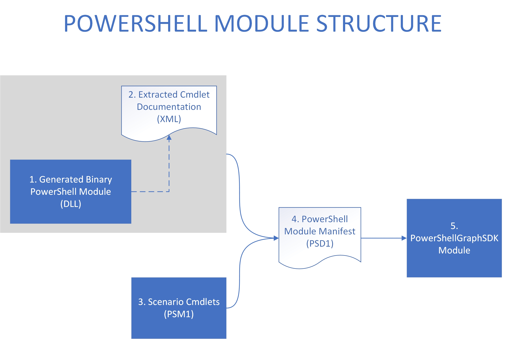
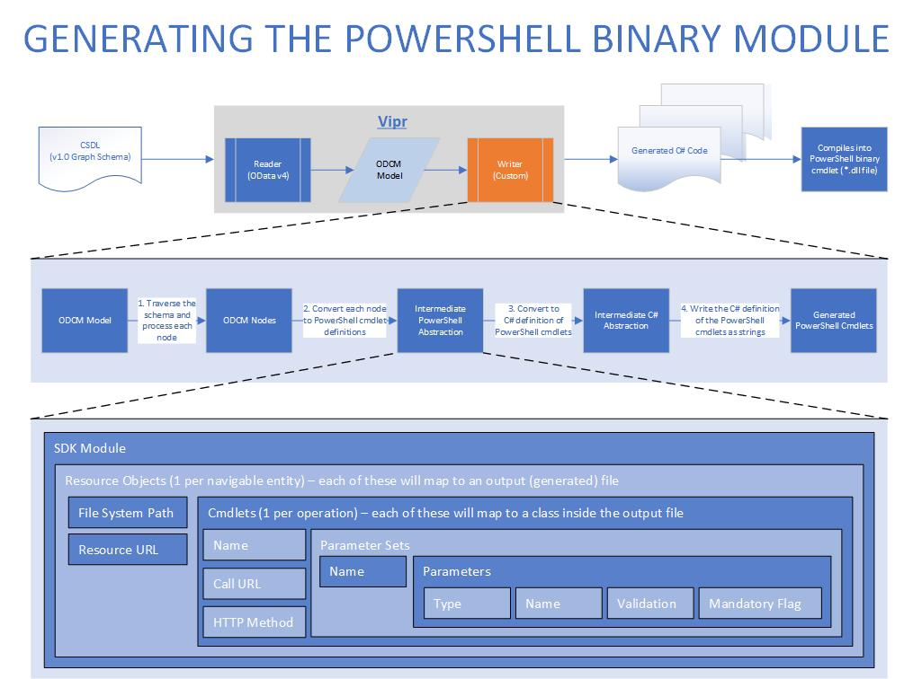

# Table of Contents
- [Table of Contents](#table-of-contents)
- [Intune-PowerShell-SDK-Code-Generator](#intune-powershell-sdk-code-generator)
- [Contributing](#contributing)
- [Design](#design)
    - [High-Level Architecture](#high-level-architecture)
    - [The Auto-Generation Step](#the-auto-generation-step)
- [Future work](#future-work)
- [FAQ](#faq)
    - [Where is the generated code?](#where-is-the-generated-code)
    - [Why do we need this PowerShell module?](#why-do-we-need-this-powershell-module)
    - [Why do we want to auto-generate the PowerShell module?](#why-do-we-want-to-auto-generate-the-powershell-module)
    - [Why is Intune building it (and why isn't the Graph SDK team building it)?](#why-is-intune-building-it-and-why-isnt-the-graph-sdk-team-building-it)
    - [What is Vipr?](#what-is-vipr)
    - [Why a custom writer?](#why-a-custom-writer)
    - [Why not use OpenAPI and Swagger?](#why-not-use-openapi-and-swagger)

# Intune-PowerShell-SDK-Code-Generator
This repository implements the Vipr writer that generates PowerShell cmdlets for all CRUD operations, functions and actions for Microsoft Intune Graph Api support.

# Contributing
This project welcomes contributions and suggestions.  Most contributions require you to agree to a
Contributor License Agreement (CLA) declaring that you have the right to, and actually do, grant us
the rights to use your contribution. For details, visit https://cla.microsoft.com.

When you submit a pull request, a CLA-bot will automatically determine whether you need to provide
a CLA and decorate the PR appropriately (e.g., label, comment). Simply follow the instructions
provided by the bot. You will only need to do this once across all repos using our CLA.

This project has adopted the [Microsoft Open Source Code of Conduct](https://opensource.microsoft.com/codeofconduct/).
For more information see the [Code of Conduct FAQ](https://opensource.microsoft.com/codeofconduct/faq/) or
contact [opencode@microsoft.com](mailto:opencode@microsoft.com) with any additional questions or comments.

# Design
## High-Level Architecture

This is the overview of how the PowerShell module is put together.
1. Vipr.exe is run with the following arguments in order to generate the code which defines the behavior of the cmdlets.
    - The build output of the GraphODataPowerShellWriter project (i.e. GraphODataPowerShellWriter.dll).
    - A Graph schema (e.g. the result of calling https://graph.microsoft.com/v1.0/$metadata) - this file has the extension ".csdl" and is located in "~/TestGraphSchemas".
2. The documentation that was generated in the output of Vipr gets extracted into an XML file. This XML file is used by PowerShell to display the output of the 'Get-Help' cmdlet.
3. Some functionality makes more sense to be hand-written in PowerShell, so these cmdlets are written in their own modules. These modules are located in "~/src/PowerShellGraphSDK/PowerShellModuleAdditions/CustomModules".
4. The outputs of the previous 3 steps (i.e. the generated cmdlets, the cmdlet documentation and the hand-written cmdlets) are combined using a PowerShell manifest file. This file has the extension ".psd1".
5. The PowerShell manifest file created in the previous step is then used to import and use the module. For example, if the manifest file was called "Intune.psd1", you can in a PowerShell window run "Import-Module ./Intune.psd1" to import the module.

## The Auto-Generation Step

This is a detailed look at step 1 in the [High-Level Architecture](#high-level-architecture) section.
- The schema definition (CSDL) file is fed into Vipr.
- The OData v4 reader which is built into Vipr is used to read the CSDL file. This reader converts the schema definition into an intermediate representation, called the ODCM Model.
- Our custom writer is passed to Vipr to process this ODCM model. The writer consists of 4 steps in order to convert the ODCM model to the final generated C# files:
    1. Traverse the ODCM Model (i.e. the schema) to discover each route.
    2. For each route, create an abstract representation of the cmdlets that represent each operation on the route.
    3. Convert each abstract cmdlet representation into an abstract C# representation.
    4. For each abstract C# representation, convert it to a string which will be written as the contents of a file.

# Future work
- [ ] Improve naming of the generated cmdlets.
    - [ ] See if we can add annotations to the Graph schema that can be used to create friendly names for routes.
- [ ] Find a way to generate and build cmdlets for the whole Graph schema in a reasonable amount of time.
    - The number of routes (due to navigation properties) dramatically increases once the AAD entities are included.
- [ ] Get the generated cmdlet help documentation to include a link to the appropriate page in the official Graph documentation.
- [x] Implement piping of cmdlet outputs directly into other cmdlets.
- [ ] Implement non-interactive auth.
    - [ ] Auth with certificates.
    - [x] Auth with a PSCredential object.
- [x] Ensure we get the correct auth token expiry time - this is handled by automatically refreshing the token when required.
- [x] Create a separate repo for the scenario cmdlets (to be used as a submodule).
- [ ] Travis CI GitHub integration + test cases.
- [x] Create a license file for the third party software we use and include it in the module.
- [x] Update the *.psd1 file to include the correct links to the public GitHub, license file and icon.
- [x] Create helper cmdlets which create objects that can be serialized to the types defined in the schema.
- [ ] Get OData Capability Restrictions added to the Graph schema so that cmdlets which perform disallowed operations won't be generated in the first place.

# FAQ
## Where is the generated code?
GitHub: https://github.com/Microsoft/Intune-PowerShell-SDK

## Why do we need this PowerShell module?
Customers have expressed a lot of interest in using PowerShell to automate tasks which are currently executed through the Intune extension in the Azure Portal.

## Why do we want to auto-generate the PowerShell module?
If we manually hand-write the cmdlets, we would need to manually update the cmdlets each time 

## Why is Intune building it (and why isn't the Graph SDK team building it)?
Most of Intune's user base (IT Professionals) would prefer to work with PowerShell, whereas the Graph SDK is catered towards developers who would prefer to work with e.g. C#, Java and Python. This is why we need it urgently. The structure of PowerShell's syntax does not lend itself to the structure of the existing .Net/Java/Python SDK generator (see the explanation of why we have a [Custom Vipr Writer](#why-a-custom-writer)).

## What is Vipr?
- The architecture is built around a Microsoft Research project called Vipr.
- It generalizes the concept of transforming information from one syntax to another.
- It is essentially a modular text parser which is especially well suited to OData-style service definitions.
- The executable accepts a Reader assembly and Writer assembly.
    - The Reader is able to parse the input text file into Vipr's intermediate (generic) representation.
    - The Writer accepts this intermediate representation and returns a list of file objects, i.e. (string,path) pairs.
        - Vipr then writes these files in the given file structure to the output folder.

## Why a custom writer?
No existing PowerShell writers are available for Vipr. Also, the .Net/Java/Python Graph SDK's writer would not easily lend itself to PowerShell's syntax, behavior or best practices.

## Why not use OpenAPI and Swagger?
This would have been possible, but would require an extra transformation from Graph's OData schema to the OpenAPI format. With every transformation comes the risk of losing information which could be valuable in the generated PowerShell module.